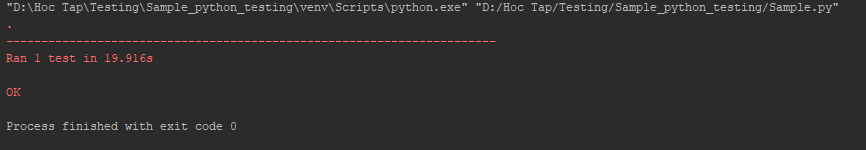

# Python example selelium

1. Clone project
2. Run install packgest

	- pip install -r requirements.txt
	
3. Download Drivers

- Chrome:	https://sites.google.com/a/chromium.org/chromedriver/downloads
- Edge:	https://developer.microsoft.com/en-us/microsoft-edge/tools/webdriver/
- Firefox:	https://github.com/mozilla/geckodriver/releases
- Safari:	https://webkit.org/blog/6900/webdriver-support-in-safari-10/

4. Run sample test
    - $ python Sample.py

Result 
